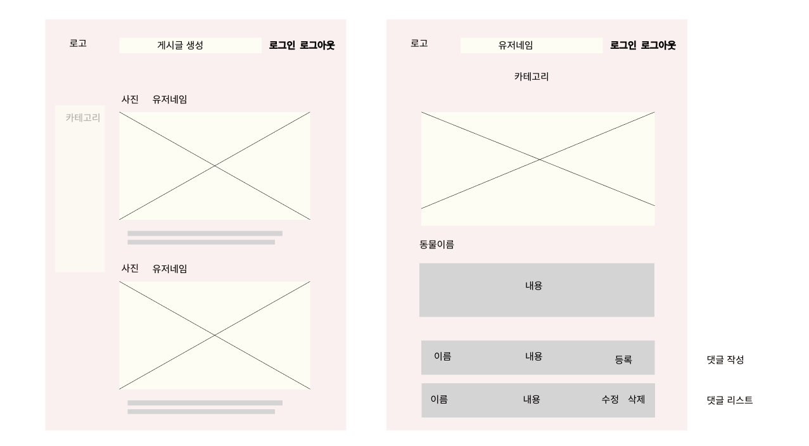
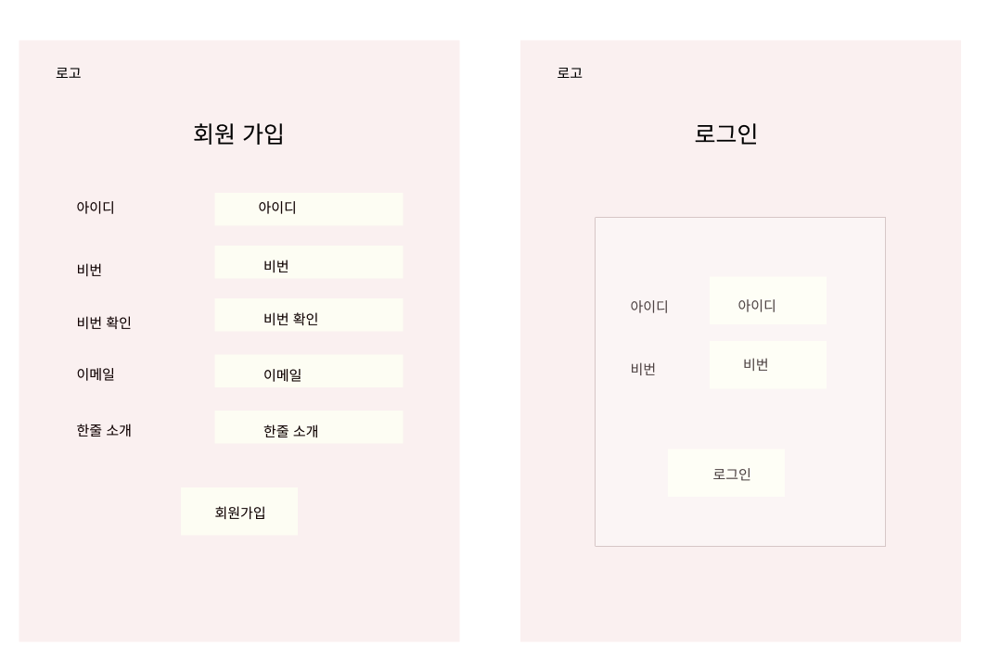

# IT`s Pets
- ### MBTI ```ITP```를 가진 사람들이 만든 반려동물 소통 게시판

[](https://github.com/eunji624/node-teamProject-newsFeed)

- 모든 사람들이 반려동물을 위해 힐링할 수 있는 공간
- 반려동물을 키우는 사람들간에 소통하는 공간

## 참여 인원

<table>
  <tbody>
    <tr>
      <td align="center"><a href="https://github.com/eunji624"><br /><sub><b> 팀장 : 유은지 </b></sub></a><br /></td>
      <td align="center"><a href="https://github.com/leesin1040"><br /><sub><b> 팀원 : 최이진 </b></sub></a><br /></td>
      <td align="center"><a href="https://github.com/Han9526"><br /><sub><b> 팀원 : 한승준 </b></sub></a><br /></td>
    </tr>
  </tbody>
</table>

##  URL

http://mallish.store/api/main

## 주요 기능

- **반려동물 뉴스피드**
- **로그인/회원가입**: User는 로그인/회원가입을 할 수 있습니다
- **게시판 CRUD**: 로그인한 User는 자신의 반려동물의 사진을 게시판 및 카테고리를 통해 자랑 및 소통 을 할 수있는 공간입니다.
- **댓글 CRUD**: User는 각 게시판에 대해 댓글을 통해 다른 사람들간에 소통을 할 수있는 공간입니다.

## Skills

- 
- 
- 
- 
- 
- 
- 
- 


## 역할

- **로그인/회원가입,validator,프론트 및 배포**:<a href="https://github.com/eunji624"><sub><b> 팀장 : 유은지 </a>
- **게시글CRUD 및 프론트 총괄**: <a href="https://github.com/leesin1040"><sub><b> 팀원 : 최이진 </a>
- **댓글CRUD 및 IMG Upload**: <a href="https://github.com/Han9526"><sub><b> 팀원 : 한승준 </a>

## WireFrame





## ERD


## API 및 Project 진행

[Notion](https://teamsparta.notion.site/7-IT-s-Pets-da031492647841ffa39226b9a47aa520)


| URL        | Method   | Function                       | Request                                  | 
|------------------|----------|----------------------------|------------------------------------------|
| api/register            | POST      | 회원가입               | name, email, password, description                  
| api/auth/login          | POST      | 로그인                 | email, password                                    
| api/auth/logout         | GET       | 로그아웃               | name: 사용자 이름, email: 사용자 이메일              
| api/user/:userId        | POST      | 회원탈퇴               |                                                    
| api/user/:userId        | GET       | 회원정보조회           | 기능만 존재 구현X                                     
| api/user/modify/:userId | POST      | 회원정보 수정          | name, email, description, password, passwordRe       
| api/main                | GET       | 메인페이지             |                                                     
| api/main/:category      | GET       | 카테고리별 조회        |                                                    
| api/post                | POST      | 게시물 작성            | title, content, category, petName ,ImgUrl           
| api/post/:postId        | DELETE    | 게시물 삭제            | password                                             
| api/search/:searchWord' | GET       | 게시물 검색            | req.params.searchWord                                
| api/post/modify/:postId'| PATCH     | 게시물 수정            | category, title, content, petName, req.params.postId  
| api/post/:postId        | GET       | 상세 게시물,댓글 조회   |                                                    
| api/comment/:postId     | POST      | 댓글 작성              | content,req.params                                
| api/comment/:postId     | PATCH     | 댓글 수정              | req.params                                          
| api/comment/:postId     | DELETE    | 댓글 삭제              | req.params                                        

